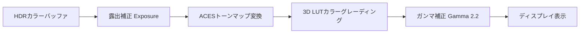

import { Aside } from '@astrojs/starlight/components';

室内レンダリングでは、暗いクローゼットの隅から、直射日光が差し込む非常に明るい窓際まで、**きわめて明暗差の激しい（ハイダイナミックレンジ: HDR）シーン**を処理する必要があります。
これを単純な低輝度ディスプレイ（SDR）に出力すると、明るい部分が白飛び（白潰れ）し、暗い部分が黒潰れしてしまいます。

AtmosFioreでは、この広大なダイナミックレンジを美しく画面に収める **ACESトーンマッピング** と、映画のフィルムのような色味を表現する **3D LUT（Look-Up Table）によるカラーグレーディング** をポストプロセスとして実装しています。

---

## 📐 トーンマップ＆カラーグレーディングの処理フロー

レンダリング結果のHDRカラー値は、以下のパイプラインに沿って補正され、最終的な画面（LDR）へ変換されます。



### 1. ACES Filmic Tone Mapping
映画業界の標準規格である **ACES（Academy Color Encoding System）** に基づくトーンマップ曲線を適用します。高輝度領域を緩やかに白へと収束させ、中間のコントラストを維持しつつ、暗部を美しく引き締める「フィルム調」の特性を持ちます。

### 2. 3D LUT による色調補正
RGBそれぞれの入力値をインデックスとして、用意されたテクスチャ（カラーテーブル）から目標となる色味を補間（サンプリング）して抽出します。これにより、コントラスト調整、セピア化、冷たい雰囲気（Cold Tint）などのシネマティックなトーンを1回のテクスチャフェッチで高速に適用できます。

---

## 💻 HLSLコード実装

以下は、AtmosFioreのポストプロセスパスで稼働する、ACESトーンマッピングおよび3D LUTサンプリングのHLSLコード例です。

```hlsl
// PostProcessEffects.hlsl
Texture2D mainSceneTexture   : register(t0);
Texture3D colorLUT           : register(t1); // 3Dテクスチャとして用意されたLUT
SamplerState defaultSampler   : register(s0);
SamplerState lutSampler       : register(s1); // 3D LUT補間用のバイリニアサンプラー

cbuffer PostProcessBuffer : register(b0)
{
    float exposure;   // 露出補正係数 (例: 1.0)
    float gamma;      // ガンマ値 (例: 2.2)
};

// ACES（Academy Color Encoding System）トーンマップの数学的近似式
float3 ACESFilm(float3 x)
{
    float a = 2.51f;
    float b = 0.03f;
    float c = 2.43f;
    float d = 0.59f;
    float e = 0.14f;
    return clamp((x * (a * x + b)) / (x * (c * x + d) + e), 0.0f, 1.0f);
}

// 3D LUTを用いたカラーサンプリング
float3 Apply3DLUT(float3 color)
{
    // LUTのテクスチャサイズ（例: 16x16x16 または 32x32x32）に合わせてスケール変換
    // 境界値サンプリングのズレを防ぐため、半ピクセル分内側にオフセットを入れる
    float lutSize = 16.0f;
    float3 scale = (lutSize - 1.0f) / lutSize;
    float3 offset = 1.0f / (2.0f * lutSize);
    
    float3 lutCoords = clamp(color, 0.0f, 1.0f) * scale + offset;
    
    // 3D LUTテクスチャからカラーサンプリング（三次元線形補間）
    return colorLUT.SampleLevel(lutSampler, lutCoords, 0).rgb;
}

float4 main(float4 position : SV_POSITION, float2 uv : TEXCOORD0) : SV_TARGET
{
    // シーンのHDRカラーを取得
    float3 hdrColor = mainSceneTexture.Sample(defaultSampler, uv).rgb;

    // 1. 露出の適用
    hdrColor *= exposure;

    // 2. ACESトーンマッピング
    float3 ldrColor = ACESFilm(hdrColor);

    // 3. カラーグレーディング (3D LUT)
    float3 gradedColor = Apply3DLUT(ldrColor);

    // 4. ガンマ補正 (ディスプレイ用の色空間へ変換)
    float3 finalColor = pow(gradedColor, float3(1.0f / gamma, 1.0f / gamma, 1.0f / gamma));

    return float4(finalColor, 1.0f);
}
```

---

## ⚡ ポストプロセスの重要性と演出効果

<Aside type="tip">
  PBRやGIが「物理的に正しい計算」であるのに対し、カラーグレーディングは「意図した心理的効果を生むためのアートワーク」です。
</Aside>

- **暖色系（Warm Tone）の適用:** 朝日の差し込む部屋や、夕暮れの密室など、部屋の温度感を表現したい場合に適しています。
- **寒色系（Cool Tone）の適用:** コンクリート打ちっぱなしのモダンスタイルの室内や、雨の日の静謐な冷たさを際立たせる効果があります。
- **ヴィネット効果（Vignetting）:** 画面の四隅の輝度を緩やかに落とすことで、プレイヤーの視線を中心に誘導し、室内空間の「閉塞感とプライベートな深み」を高めるのに貢献しています。
