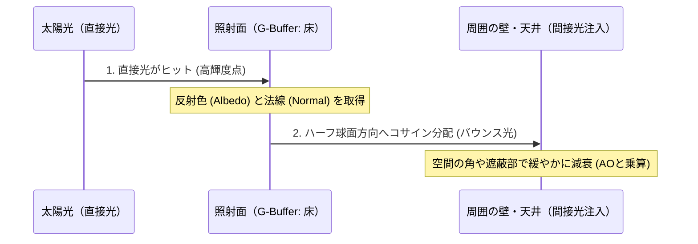

import { Aside } from "@astrojs/starlight/components";

グラフィックスにおいて、窓から入ってきた太陽光が床に当たり、その光が跳ね返って部屋全体を柔らかく照らす現象を **グローバルイルミネーション（GI / 間接光）** と呼びます。
特に四方を壁に囲まれた室内表現においては、直接光（直射日光）が当たらない箇所がほとんどであるため、GI の実装は「空間の空気感」を描くために必須です。

AtmosFioreでは、DirectX 11の負荷制約の中で動的な光のバウンスをシミュレートするため、**カスタムライトマップ・インジェクション**と**スクリーンスペース・ライトバウンス（SSLB）**を応用した軽量リアルタイムGIアルゴリズムを実装しています。

---

## 📐 アルゴリズム概要

室内の一点に降り注ぐ光エネルギーは、次のように定義されます。

```
L_out = L_direct + L_indirect
```

ここで、間接光 `L_indirect` は、直射日光 `L_direct` が反射面（床など）に当たった際に、その反射面を「二次光源」として扱い、周囲の空間へコサイン重み付けされた放射束を再分配（インジェクション）することで計算されます。



---

## 💻 HLSLコード実装

以下は、床や壁からのバウンス光（間接拡散反射）をシミュレートするピクセルシェーダーのHLSLコード例です。

```hlsl
// GlobalIllumination.hlsl
struct PixelInput
{
    float4 position : SV_POSITION;
    float2 uv : TEXCOORD0;
};

// 頂点ごとのバッファ情報
cbuffer LightBuffer : register(b0)
{
    float3 lightDirection;   // 太陽光の方向
    float3 lightColor;       // 太陽光の色強度
    float3 indirectIntensity;// 間接光の強度倍率
};

Texture2D gBufferAlbedo    : register(t0);
Texture2D gBufferNormal    : register(t1);
Texture2D gBufferDepth     : register(t2);
SamplerState defaultSampler : register(s0);

// コサイン重み付き間接光の計算
float3 CalculateIndirectBounce(float3 worldPos, float3 normal, float3 albedo)
{
    // 簡易的な下方バウンスモデル (床からの照り返しをシミュレート)
    float3 floorNormal = float3(0.0f, 1.0f, 0.0f);

    // 床に当たった直接光の強さを近似
    float floorDot = max(dot(-lightDirection, floorNormal), 0.0f);
    float3 floorReflectedColor = albedo * lightColor * floorDot;

    // 現在のピクセル法線と床（上向き）とのコサイン重みを算出
    float bounceWeight = max(dot(normal, floorNormal) * 0.5f + 0.5f, 0.0f);

    // 周囲からのアンビエントオクルージョン（AO）による遮蔽を乗算
    float ao = 1.0f; // 実際はG-BufferまたはSSAOテクスチャからサンプリング

    return floorReflectedColor * bounceWeight * indirectIntensity * ao;
}

float4 main(PixelInput input) : SV_TARGET
{
    float3 albedo = gBufferAlbedo.Sample(defaultSampler, input.uv).rgb;
    float3 normal = gBufferNormal.Sample(defaultSampler, input.uv).rgb * 2.0f - 1.0f;
    normal = normalize(normal);

    // 直接光の計算 (Lambertモデル)
    float3 directLight = albedo * lightColor * max(dot(normal, -lightDirection), 0.0f);

    // 間接光（GIバウンス）の計算
    float3 indirectLight = CalculateIndirectBounce(input.position.xyz, normal, albedo);

    // 合計カラー
    float3 finalColor = directLight + indirectLight;

    return float4(finalColor, 1.0f);
}
```

---

## ⚡ 最適化と実装の工夫

<Aside type="tip">
  間接光は本来、シーン全体のレイトレーシングが必要ですが、リアルタイム動作のために**低周波（なだらかに変化する）成分**のみを対象としています。
</Aside>

1. **ハーフ解像度レンダリング:**
   間接光のバウンスマップは急激な変化（高周波成分）が少ないため、通常の半分の解像度（1/4ピクセル数）でバウンスバッファを計算。その後、バイラテラルフィルターを用いてエッジを維持しながら拡大・合成することで、描画負荷を大幅に削減しています。
2. **SSAO（スクリーンスペース・アンビエントオクルージョン）との相乗効果:**
   間接光は部屋の角や家具の隙間などの狭い場所には届きません。自作のSSAOバッファを間接光に乗算することで、隅部分のコントラスト（シャドウ）が際立ち、光と影のメリハリをさらに強めています。
