import { CardGrid, LinkCard, Card } from '@astrojs/starlight/components';

AtmosFioreは、室内空間特有の「光の差し込み」「空気感」をDirectX 11上でフォトリアルに描き出すカスタムレンダリングパイプラインです。
このセクションでは、本シェーダーエンジンを構成する4つのコア技術について詳細なアルゴリズムとコード（HLSL/C++）の解説を提供します。

---

## 🎨 レンダリングパイプライン

AtmosFioreは、複雑なマテリアルと高精度な反射を両立させるため、以下のパイプラインに沿って描画処理を行っています。

```mermaid
graph TD
    A[1. ジオメトリパス G-Buffer生成] --> B[2. ディレクショナルライト / リアルタイムGI]
    B --> C[3. 物理ベースマテリアル PBR適用]
    C --> D[4. スクリーンスペース反射 SSRパス]
    D --> E[5. シネマティックカラー & ポストプロセス]
    E --> F[最終画面出力]
    style B fill:#451a03,stroke:#f59e0b,stroke-width:2px
    style D fill:#1e3a8a,stroke:#3b82f6,stroke-width:2px
    style E fill:#064e3b,stroke:#10b981,stroke-width:2px
```

---

## 🔧 主要技術の個別解説

<CardGrid>
  <Card title="Global Illumination (GI)" icon="sun">
    窓から差し込む一筋の平行光が、床で反射して天井や角を照らす「間接光のバウンス」をリアルタイムに近似シミュレート。室内の陰影に柔らかなグラデーションを与えます。
    
    <LinkCard title="GIの実装技術を見る" href="./global-illumination/" />
  </Card>

  <Card title="Physical Material (PBR)" icon="setting">
    大理石の微細な鏡面反射、木材の微細な吸光、遮光カーテンの半透過（SSS）を物理的に正しく定義。室内の質感をリアルに描き分けます。
    
    <LinkCard title="PBRの実装技術を見る" href="./pbr/" />
  </Card>

  <Card title="Sharp SSR / Reflection" icon="eye">
    大理石の床やガラスへの鏡面反射投影。Hi-Zレイマーチングを用いて、解像度ごとの深度バッファから高速かつ高精度な交点検知を行います。
    
    <LinkCard title="SSRの実装技術を見る" href="./ssr/" />
  </Card>

  <Card title="Cinematic Color Grading" icon="document">
    HDRの光を美しく圧縮するACESトーンマップ、および映画の一コマのような質感に補正するLUT（ルックアップテーブル）の適用手法。
    
    <LinkCard title="カラーグレーディングの実装技術を見る" href="./color-grading/" />
  </Card>
</CardGrid>
