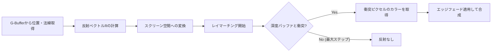

import { Aside } from '@astrojs/starlight/components';

静寂感のある室内の磨き上げられた床やガラス。そこに周囲の壁や光源が滑らかに写り込む様子は、質感のリアリティを大幅に引き上げます。
AtmosFioreでは、シーン全体のオブジェクトを2回描画することなく、画面情報（G-Buffer）から高精度な反射像を作り出す **スクリーンスペース・リフレクション（SSR / 画面空間反射）** を自社開発しています。

---

## 📐 アルゴリズムのワークフロー

SSRの基本処理は、各ピクセルから反射ベクトル方向に「レイ（光線）」を飛ばし、カメラから見えている遮蔽物（深度バッファ）と衝突するかどうかを判定する**レイマーチング法**に基づきます。



---

## 💻 HLSLコード実装

以下は、スクリーン空間におけるレイマーチングと、反射ピクセルのサンプリングを行うHLSLピクセルシェーダーコードです。

```hlsl
// ScreenSpaceReflection.hlsl
cbuffer SSRBuffer : register(b0)
{
    matrix viewMatrix;
    matrix projectionMatrix;
    float maxRayDistance;   // レイマーチングの最大距離
    int maxSteps;           // 最大ループ回数 (例: 64)
    float depthTolerance;   // 衝突判定の厚みしきい値
};

Texture2D gBufferNormal     : register(t0);
Texture2D gBufferDepth      : register(t1);
Texture2D mainColorScene    : register(t2); // ポストプロセス前のカラーバッファ
SamplerState defaultSampler : register(s0);

// スクリーン空間でのレイマーチング
bool RayMarch(float3 rayOrigin, float3 rayDir, out float2 hitUV)
{
    float3 currentPos = rayOrigin;
    
    // レイのステップ幅を決定
    float3 stepVector = rayDir * (maxRayDistance / (float)maxSteps);

    for (int i = 0; i < maxSteps; i++)
    {
        currentPos += stepVector;

        // ビュー空間の位置をスクリーン（UV）空間に変換
        float4 clipPos = mul(projectionMatrix, float4(currentPos, 1.0f));
        float3 ndcPos = clipPos.xyz / clipPos.w;
        
        // NDC座標 [-1, 1] から テクスチャUV [0, 1] への変換
        float2 uv = ndcPos.xy * 0.5f + 0.5f;
        uv.y = 1.0f - uv.y; // DirectX規格のY反転

        // 画面外判定
        if (uv.x < 0.0f || uv.x > 1.0f || uv.y < 0.0f || uv.y > 1.0f)
            return false;

        // 現在のサンプリング点のカメラ深度を取得
        float sampleDepth = gBufferDepth.SampleLevel(defaultSampler, uv, 0).r;
        
        // カメラ深度値からビュー空間の深度（Z座標）を復元
        // (プロジェクション行列の性質を利用して簡易復元)
        float currentDepthZ = currentPos.z;
        float sceneDepthZ = projectionMatrix._43 / (sampleDepth - projectionMatrix._33);

        // 衝突判定 (レイの現在位置が、シーンの深度より奥にあり、かつ厚みパラメータの範囲内であるか)
        if (currentDepthZ > sceneDepthZ && (currentDepthZ - sceneDepthZ) < depthTolerance)
        {
            hitUV = uv;
            return true;
        }
    }
    return false;
}

// スクリーン端の破綻を隠すための減衰関数
float CalculateEdgeFade(float2 uv)
{
    float2 edge = smoothstep(0.0f, 0.1f, uv) * smoothstep(0.0f, 0.1f, 1.0f - uv);
    return edge.x * edge.y;
}

float4 main(float4 position : SV_POSITION, float2 uv : TEXCOORD0) : SV_TARGET
{
    // G-Bufferからビュー空間の位置と法線を復元
    float depth = gBufferDepth.Sample(defaultSampler, uv).r;
    float3 normal = gBufferNormal.Sample(defaultSampler, uv).rgb * 2.0f - 1.0f;
    normal = normalize(normal);
    
    // 簡易ビュー空間座標の算出
    float sceneDepthZ = projectionMatrix._43 / (depth - projectionMatrix._33);
    float3 viewPos = float3((uv.x * 2.0f - 1.0f) * sceneDepthZ, (1.0f - uv.y * 2.0f) * sceneDepthZ, sceneDepthZ);

    // ビュー方向（カメラから現在地へのベクトル）
    float3 viewDir = normalize(viewPos);
    
    // 反射ベクトルの計算
    float3 reflectDir = reflect(viewDir, normal);

    float2 hitUV = float2(0.0f, 0.0f);
    float3 reflectionColor = float3(0.0f, 0.0f, 0.0f);
    float SSRMask = 0.0f;

    // レイマーチング実行
    if (RayMarch(viewPos, reflectDir, hitUV))
    {
        reflectionColor = mainColorScene.Sample(defaultSampler, hitUV).rgb;
        
        // 画面端のフェードを計算し、不自然な切り切れを防ぐ
        SSRMask = CalculateEdgeFade(hitUV);
    }

    // 元のシーンカラーと反射カラーのブレンド
    float3 originalColor = mainColorScene.Sample(defaultSampler, uv).rgb;
    
    // 簡易反射強度（マテリアルの鏡面反射強度などに応じて制御）
    float reflectionStrength = 0.5f; 
    float3 finalColor = lerp(originalColor, reflectionColor, SSRMask * reflectionStrength);

    return float4(finalColor, 1.0f);
}
```

---

## ⚡ 課題と最適化技術

<Aside type="caution">
  スクリーンスペース技術の弱点として、「画面外のオブジェクトは反射に写らない」という原理的限界があります。
</Aside>

1. **フォールバックライティング:**
   レイマーチングが画面外に逸れたり、遮蔽物の裏に入って衝突が検知できなかった場合、完全に反射を消すのではなく、環境マップ（CubeMap）による静的な反射（IBL: Image-Based Lighting）へシミュレーションを切り替えています。これにより、反射像の連続性を崩さずに安定した質感を保ちます。
2. **Hi-Z (Hierarchical Z) レイマーチング:**
   深度マップのMipmap（階層化深度バッファ）を利用する手法。上のMipレベル（解像度の粗いレベル）でレイマーチを大雑把に進め、衝突の可能性がある場所でのみ下のMipレベル（高解像度）へ降りて細かく探索します。ピクセルごとにループを何十回も回す無駄を省き、描画パフォーマンスを大幅に向上させます。
